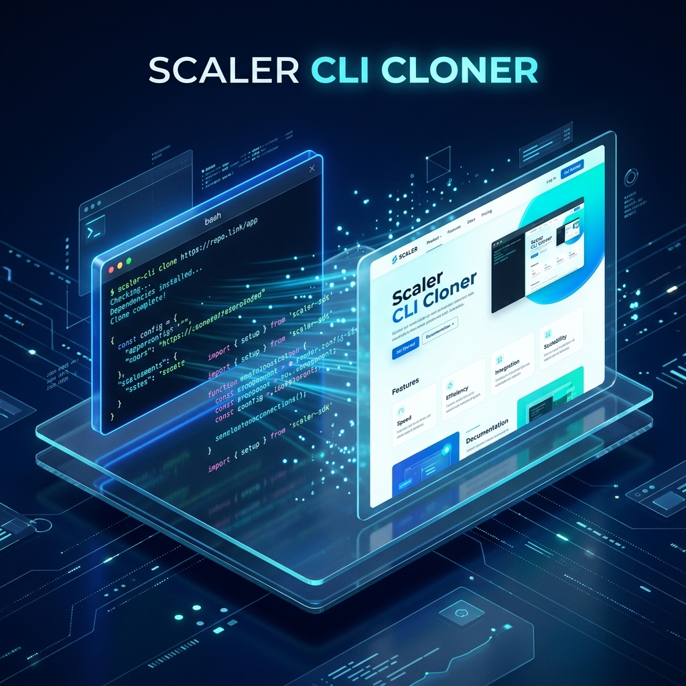
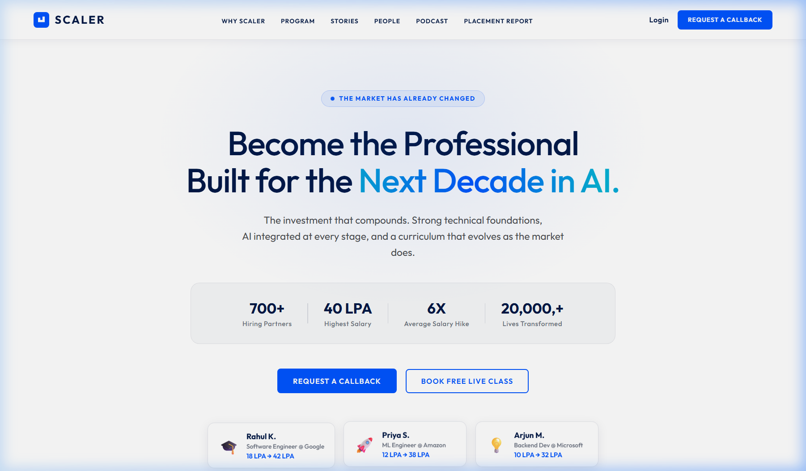

# <p align="center">🌐 Scaler CLI Cloner</p>

<p align="center">
  
</p>

<p align="center">
  
  
  
  
</p>

---

## 📖 Overview

**Scaler CLI Cloner** is an autonomous, AI-powered agent designed to clone websites into high-fidelity, responsive HTML/CSS/JS. Leveraging **OpenRouter's** advanced LLMs, it operates in a continuous agentic loop to think, execute tools, and refine its output until perfection is achieved.

> [!TIP]
> This agent is built specifically for high-fidelity cloning, adhering to strict design principles like no inline styles and responsive-first CSS.

---

## 🖼️ Showcase

<p align="center">
  <b>Pixel-perfect Light Mode Hero Section</b><br>
  
</p>

---

## ✨ Key Features

- 🤖 **Autonomous Agentic Loop**: Self-driven execution (`START → THINK → TOOL → OBSERVE → OUTPUT`).
- ⚡ **OpenRouter Integration**: Defaulting to the powerful `Llama-3.3-70B` for intelligent design choices.
- 🛠️ **Swiss Army Knife Tools**: 6 specialized tools for fetching design data, file management, and HTML validation.
- 🎨 **Premium Aesthetics**: Automatic support for animated gradients, glassmorphism, and modern typography.
- 📱 **Mobile & Desktop Optimized**: Generates fully responsive code out of the box.
- 🚀 **One-Shot Auto Mode**: Fully autonomous cloning with a single command.

---

## 🚀 Getting Started

### 1. Prerequisites

- [Node.js](https://nodejs.org/) (v16 or higher)
- An [OpenRouter API Key](https://openrouter.ai/keys)

### 2. Installation

Clone the repository and install dependencies:

```bash
git clone https://github.com/Sid13SST/Scaler_CLI_cloner.git
cd Scaler_CLI_cloner
npm install
```

### 3. Configuration

Create a `.env` file in the root directory and add your API key:

```env
OPENROUTER_API_KEY=your_openrouter_api_key_here
```

---

## 🎮 Usage

The Scaler CLI Cloner offers two primary modes of operation:

### 💬 Chat Mode (Conversational)
Interact with the agent naturally to build or modify your clone.
```bash
node src/index.js
```
*Try saying:* `"Clone the Scaler Academy website into 'scaler_clone'"`

### 🤖 Auto Mode (Autonomous)
Let the agent handle everything from start to finish.
```bash
# Default Scaler Clone
node src/index.js --auto

# Clone a custom URL
node src/index.js --auto https://www.interviewbit.com
```

### ⚙️ Command Line Arguments
| Flag | Description | Default |
|------|-------------|---------|
| `--model` | OpenRouter model to use | `meta-llama/llama-3.3-70b-instruct` |
| `--output` | Target folder name | `scaler_clone` |
| `--max-steps`| Max agent iterations | `20` |
| `--auto` | Run in autonomous mode | `false` |

---

## 🛠️ Internal Toolkit

The agent uses a sophisticated set of tools to interact with the web and your filesystem:

| Tool | Capability |
| :--- | :--- |
| 🔍 `fetch_page_design` | Extracts semantic data, brand colors, and layouts from a URL. |
| 📁 `create_folder` | Manages project directory structure. |
| ✍️ `write_file` | Generates clean, formatted HTML, CSS, and JS files. |
| 📖 `read_file` | Allows the agent to review and refine existing code. |
| 📂 `list_files` | Provides context on the current project state. |
| ✅ `validate_html` | Ensures the output meets modern web standards. |

---

## 📂 Project Architecture

```text
Scaler_CLI_cloner/
├── src/
│   ├── index.js     ← CLI entry point
│   ├── agent.js     ← The Brain (Agentic Loop)
│   ├── tools.js     ← The Hands (Tool Implementations)
│   ├── prompts.js   ← The Guidelines (System Prompts)
│   └── logger.js    ← The Voice (Colored Terminal Feedback)
├── scaler_clone/    ← Your generated masterpiece
└── ...
```

---

## ⚠️ Important Notes

- **Cloning Duration**: Depending on the model and complexity, a full clone typically takes **2-4 minutes**.
- **Scraper Fallback**: If a site blocks automated access, the agent utilizes its internal knowledge of modern design patterns to generate a faithful representation.
- **Pure Output**: The generated code is dependency-free HTML/CSS/JS.

---

<p align="center">
  Built with ❤️ by Siddhant Prasad
</p>
